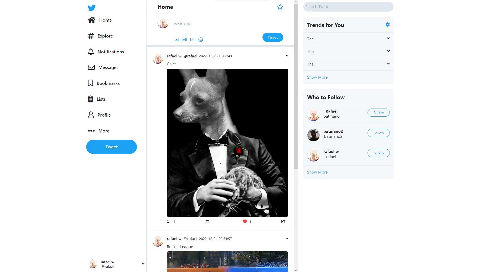

# 🐦 Twitter Clone

    Twitter Clone developed using Vue 3 + Vite + TailwindCSS + PHP + MySQL



# 💻 Techs

- Clean Architecture
- Authentication using JWT
- API REST
- Backend with PHP
- MySQL
- Automated Tests using PHPUnit
- Slim
- Vue 3
- Vite 2.0
- Vuex 4
- Vue Router 4
- Axios
- TailwindCSS

# ✨ Features

- Register and login
- Create Tweets (Text and Images)
- View Tweets Timeline
- Reply Tweets or another reply
- View Tweet Page with replies
- Like Tweets
- Retweet
- Follow users
- View following users and followers (missing)
- Profile Pages
- Edit Profile image and details (missing)

# ▶️ Demo

[View Demo]()

# 💾 How to run locally

## Backend

 On main folder run:

```bash
composer install
```

## Frontend

On Frontend/Twitter-clean-code run:

```bash
npm install
```

Run the project:
```bash
npm run dev
```